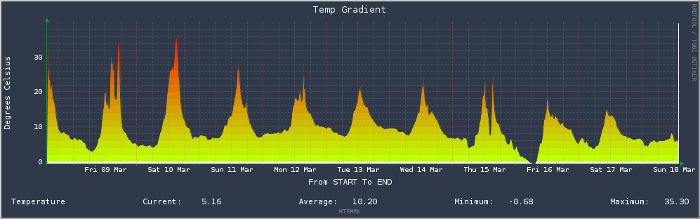
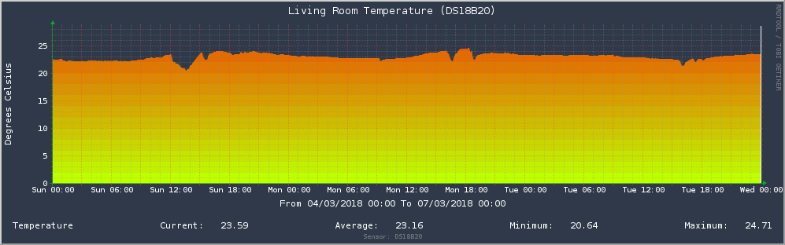
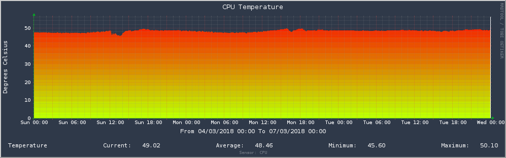
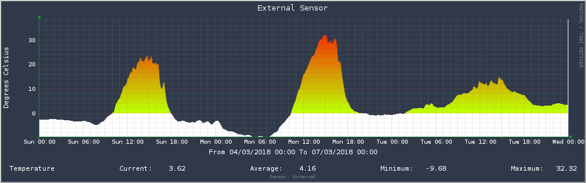
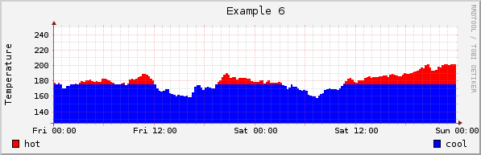
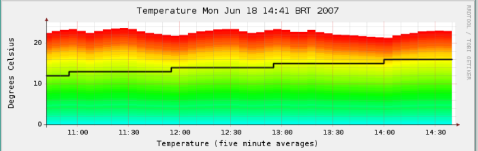

## Real (or close to real) gradients for nice RRD graphs
### Usage : temperature graphs

General idea (how it should look):

A few more:

Other [NOT] gradients from the web:

Almost but requires more thresholds.

Even if the temp would be 10 degrees it would still show as red.

|12.10.2017|
------------
##### Includes a small draft page, based on [DateRangePicker](http://www.daterangepicker.com), sitting on my Raspberry to view my datasources over a period of time.
##### Use at your own risk
